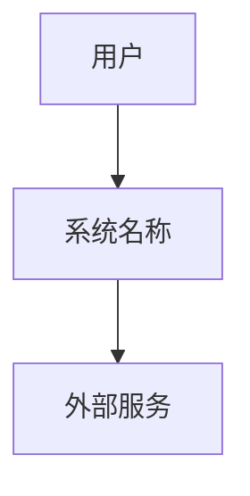
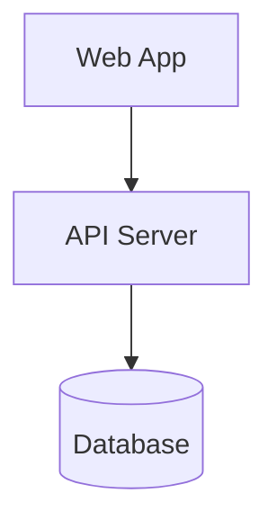

# Project Spec

## Overview

简要描述系统的整体目标、作用域、核心概念。

## System Boundary

- 系统包含哪些子域（Domain）
- 系统不处理哪些内容（明确边界）

## Bounded Contexts

<!-- 为每个 context 提供一句话说明 -->

- `{name}-domain` — [职责描述]
- `{name}-domain` — [职责描述]

## Architecture Diagrams (C4 Model)

### System Context Diagram

展示系统与外部用户、系统的交互。



### Container Diagram

展示系统内部的核心容器（Web App, API Gateway, DB）及其交互。



## Domain Model (High-level)

以结构化方式描述高层领域对象及其关系：

- **{Entity}** — [描述]
- **{Entity}** — [描述]

## Global Rules & Invariants

系统始终必须成立的全局规则：

- GR-001: [规则描述]
- GR-002: [规则描述]

## Global State Machine

描述全系统的核心状态流：

```
[初始状态] → [中间状态] → [终止状态]
```

## Evolution Timeline

记录系统世界观的重要演化事件：

- YYYY-QX: [事件描述]
