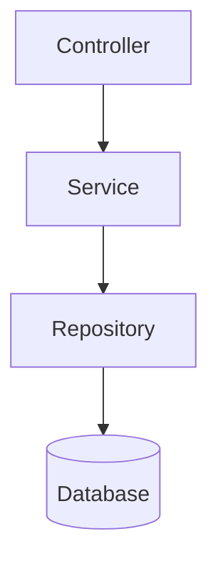

# Domain Spec — {domain_name}

## Domain Scope

简要定义该 Domain 的职责范围。

## Component Diagram (C4)



## State Machine

定义该领域模型对应的状态机：

```
[初始状态] → [中间状态] → [终止状态]
```

- **初始状态**: [描述]
- **中间状态**: [描述]
- **终止状态**: [描述]
- **转移条件**: [描述]

## Business Rules

- BR-001: [规则描述]
- BR-002: [规则描述]

## Input/Output Semantics

描述每个行为输入如何影响状态、输出如何定义：

| 操作 | 输入 | 前置条件 | 状态变化 | 输出 |
|------|------|----------|----------|------|
| [操作名] | [参数] | [条件] | [状态A → 状态B] | [返回值] |

## Constraints & Invariants

不可变真理：

- INV-001: [描述]（例如：金额必须 > 0）

## Dependencies

引用其他 Domain 的语义（不得跨越 Contract Spec）：

- 依赖 `{other}-domain`: [说明]

## Domain-Specific Patterns

<!-- 可选。仅当此 Domain 有超出 Project Spec 全局约定的特殊规范时填写 -->

- [模式描述: 例如 ID 格式、金额表示、状态变更的唯一入口]

## Evolution Log

- yyyy-mm-dd: [新增/修改/移除] [规则/状态/字段]。
  - 说明: [动机与影响范围]
